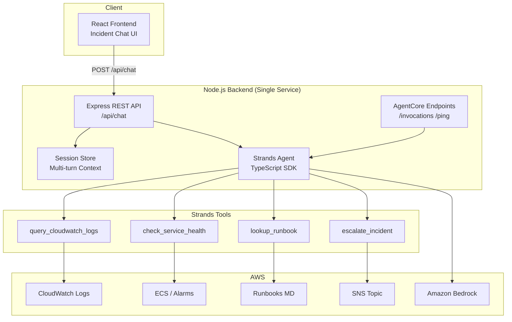

# Architecture & Design Decisions

## System Overview

## Why Single Node.js Backend?

The assessment requires **Strands + AgentCore**. Strands has a TypeScript SDK (`@strands-agents/sdk`), so the agent runs **inside the Node.js backend** — no separate Python service.

Benefits:
- One language (TypeScript/Node.js)
- Simpler local dev and deployment
- Express serves both frontend API and AgentCore contract

## Component Responsibilities

| Component | Role |
|-----------|------|
| **React Frontend** | Chat UI, session ID, example incidents |
| **Express API** | `/api/chat`, validation, error handling |
| **Strands Agent** | LLM reasoning, tool orchestration, system prompt |
| **Session Store** | Multi-turn conversation history (last 10 messages) |
| **Tools (4)** | Real AWS API calls via AWS SDK v3 |
| **AgentCore endpoints** | `/invocations` + `/ping` for AWS deployment |

## Tools — Real AWS (No Mock)

| Tool | AWS Service | Env Var |
|------|-------------|---------|
| query_cloudwatch_logs | CloudWatch Logs | `CLOUDWATCH_LOG_GROUP` |
| check_service_health | ECS + CloudWatch | `ECS_CLUSTER_NAME`, `ECS_SERVICE_NAME` |
| lookup_runbook | Local markdown files | `backend/runbooks/` |
| escalate_incident | SNS Publish | `SNS_ESCALATION_TOPIC_ARN` |

Tools return error strings on failure — agent explains and suggests alternatives.

## Session Context

1. Frontend sends `sessionId` with each message
2. Backend stores message history in memory
3. History (last 10 turns) prepended to prompt for context
4. Extensible to AgentCore Memory service for production persistence

## AgentCore Deployment

Backend Docker image exposes:
- `GET /ping` — health check (required)
- `POST /invocations` — agent invocation (required)
- Port `8080` (set via `PORT` env var)

Deploy flow: Docker → ECR → `create-agent-runtime` → invoke via AWS SDK.

## Security

- IAM least-privilege for CloudWatch, ECS read, SNS publish, Bedrock invoke
- Secrets via environment variables only
- CORS restricted to frontend origin

## AgentCore Capabilities

| Capability | Used? | Notes |
|------------|-------|-------|
| Runtime | ✅ | Docker deploy with /invocations + /ping |
| Bedrock | ✅ | Claude via BedrockModel |
| Memory | ⚠️ | In-app session store (AgentCore Memory optional upgrade) |
| Observability | ✅ | CloudWatch via AgentCore runtime logs |
| Identity | ❌ | Not needed for demo |
| Gateway/MCP | ❌ | Custom tools sufficient |

## Assumptions

1. Region: `us-east-1`
2. English incident descriptions
3. Runbooks as markdown in repo
4. Single SNS topic for escalations
