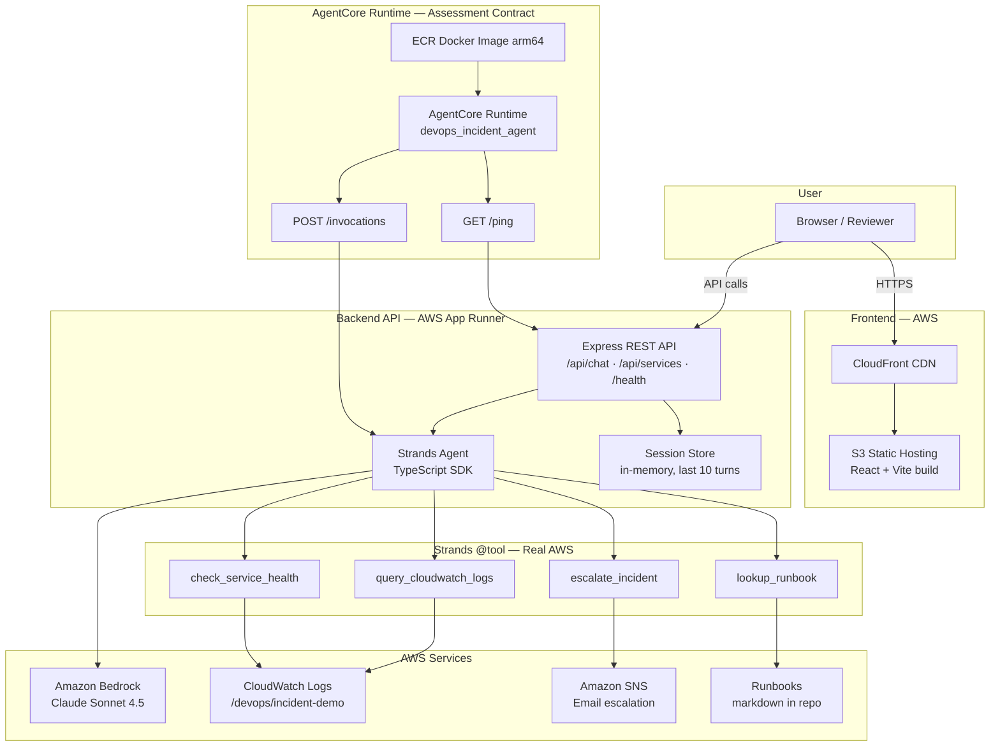
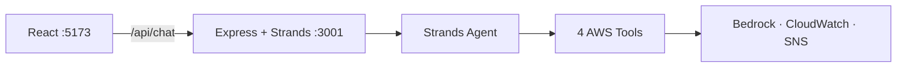

# Architecture, Design Decisions & AgentCore Capabilities

> **For reviewers:** This document answers the assessment deliverables — architecture diagram, assumptions, design decisions, and AgentCore capability choices with trade-offs. A summary also appears in [README.md](../README.md).

---

## 1. Architecture Diagram (Production)



### Same backend, two deploy targets

| Deploy target | Purpose | Image tag |
|---------------|---------|-----------|
| **AgentCore Runtime** | Assessment contract (`/ping`, `/invocations`) | `latest` (arm64) |
| **App Runner** | Public HTTPS API for React UI (`/api/*`) | `amd64` |

Both run the **same Express + Strands codebase** from one Docker image. AgentCore does not expose custom `/api/*` routes to browsers, so App Runner hosts the full REST API for the live demo.

---

## 2. Architecture Diagram (Local Development)



---

## 3. Design Decisions

| Decision | Choice | Why |
|----------|--------|-----|
| **Single backend service** | Node.js + Express + Strands in one repo | Assessment requires Strands; TypeScript SDK avoids a separate Python agent service |
| **Strands TypeScript SDK** | `@strands-agents/sdk` with `BedrockModel` | Official SDK, `@tool` decorator, fits existing Node stack |
| **AgentCore + App Runner** | AgentCore for contract; App Runner for UI API | AgentCore exposes `/ping` and `/invocations` only; browser needs `/api/services`, `/api/chat`, etc. |
| **Mock incident services** | Payment, Cart, Order simulators | Demonstrates end-to-end triage without a real production outage |
| **Real AWS for tools** | CloudWatch, SNS, Bedrock are live | Core agent tools are not mocked — reviewers can verify in AWS console |
| **In-memory sessions** | Map in Node process | Simple for demo; upgrade path to AgentCore Memory |
| **Login gate** | Client-side demo auth | Protects public CloudFront URL for assessment demo |
| **Region** | `us-east-1` everywhere | Bedrock + AgentCore availability |

---

## 4. Assumptions

1. **Region:** All resources in `us-east-1` (N. Virginia).
2. **Language:** Incident descriptions and runbooks are in English.
3. **Bedrock model:** Claude Sonnet 4.5 (`us.anthropic.claude-sonnet-4-5-20250929-v1:0`) with model access enabled.
4. **CloudWatch:** Log group `/devops/incident-demo` exists; mock incidents push real log entries.
5. **SNS:** Single topic `devops-incident-escalation` with confirmed email subscription.
6. **Runbooks:** Stored as markdown in `backend/runbooks/` (not external wiki).
7. **No real ECS cluster required:** `check_service_health` degrades gracefully if ECS env vars are empty.
8. **Demo login:** `sagar-test` / `Sagar@123` — not production-grade auth.

---

## 5. AgentCore Capabilities — What We Used & Why

### Used

| Capability | How we use it | Why chosen |
|------------|---------------|------------|
| **Runtime** | Docker on ECR → AgentCore Runtime `devops_incident_agent` | **Required** by assessment; hosts container with `/ping` and `/invocations` |
| **Bedrock** | Strands `BedrockModel` inside runtime | **Required** for LLM reasoning; Claude Sonnet 4.5 for strong tool-use |
| **Observability** | CloudWatch log group for runtime + incident logs | Real logs visible in investigation panel; standard ops pattern |

### Partially used

| Capability | How we use it | Trade-off |
|------------|---------------|-----------|
| **Memory** | In-app session store (not AgentCore Memory service) | **Trade-off:** Faster to ship, no extra AWS setup; sessions lost on restart. **Upgrade:** AgentCore Memory for persistent multi-turn context |

### Not used

| Capability | Why not | Trade-off considered |
|------------|---------|----------------------|
| **Identity / JWT inbound auth** | AgentCore IAM auth blocks browser `fetch()` without SigV4 | **Alternative:** JWT + Cognito — more secure but heavy for take-home; we use App Runner for public API and IAM on AgentCore |
| **Gateway / MCP** | Custom Strands `@tool` definitions are sufficient | **Alternative:** MCP gateway for tool reuse — adds complexity without benefit for 4 fixed tools |
| **Policy / Browser / Code Interpreter** | Out of scope for incident triage demo | Would add cost and setup time beyond assessment needs |

---

## 6. Trade-offs Summary

```
┌─────────────────────────────────────────────────────────────────┐
│  CHOSE                          │  TRADED OFF                   │
├─────────────────────────────────┼───────────────────────────────┤
│  AgentCore Runtime (assessment) │  Extra App Runner for /api/*  │
│  Strands TS in Node (1 language)│  Python Strands examples      │
│  Real AWS tools                 │  Mock services for UI demo    │
│  In-memory sessions             │  AgentCore Memory persistence │
│  Simple demo login              │  Cognito / IAM browser auth   │
│  S3 + CloudFront (not Amplify)  │  More manual deploy steps     │
└─────────────────────────────────────────────────────────────────┘
```

---

## 7. How Reviewers Can Verify

| What to check | Where |
|---------------|-------|
| **Live UI** | https://dj5efjm4yxqlb.cloudfront.net (login: `sagar-test` / `Sagar@123`) |
| **Backend health** | https://mgfxskvu6f.us-east-1.awsapprunner.com/health |
| **AgentCore `/ping`** | Same backend: `/ping` returns `{ "status": "Healthy" }` |
| **AgentCore `/invocations`** | `POST /invocations` with `{ "prompt": "..." }` |
| **AgentCore runtime** | AWS Console → Bedrock → AgentCore → `devops_incident_agent` |
| **Source code** | https://github.com/sagar-developer08/DevOps-Incident-Response |
| **Strands tools** | `backend/src/agent/tools/` |
| **AgentCore endpoints** | `backend/src/index.ts` — `/ping`, `/invocations` |

---

## 8. Component Responsibilities

| Component | Role |
|-----------|------|
| **React Frontend** | Login, service dashboard, investigation panel, chat UI |
| **CloudFront + S3** | Static hosting for production UI |
| **App Runner** | Public HTTPS API for browser |
| **AgentCore Runtime** | Assessment deployment target for agent container |
| **Express API** | REST routes, validation, CORS, error handling |
| **Strands Agent** | LLM reasoning, tool orchestration, system prompt |
| **Session Store** | Multi-turn history (last 10 messages) |
| **4 Tools** | Real AWS SDK calls (CloudWatch, health, runbook, SNS) |
| **Mock Services** | Trigger/recover Payment, Cart, Order incidents |
